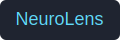

# NeuroLens Visualization Guide

## Overview
The NeuroLens dashboard delivers an offline Streamlit experience for exploring profiling runs, fingerprints, and diffs. It ships with three primary views:

- **Run Viewer** – inspect metadata, total latency, and per-op timelines.
- **Fingerprint Diff** – align two fingerprints, highlight similarity, and spotlight divergences.
- **Roofline Plot** – position each operation against a simplified roofline model to see memory- versus compute-bound behavior.

Each view is optimized for local analysis without requiring GPU access or internet connectivity.

## Launching the Dashboard
Use the `neurolens view` CLI command to start Streamlit.

```bash
# Open Run Viewer with a sample run
neurolens view --run runs/example.json

# Inspect a fingerprint directly
neurolens view --fingerprint fp/latest.json

# Compare two fingerprints and jump into the diff tab
neurolens view --compare fp/base.json fp/latest.json
```

By default the dashboard listens on `http://localhost:8501`. Provide `--port` to customize the port if the default is busy.

## Run Viewer


The Run Viewer highlights:

- Summary metrics (total latency, op count, GPU utilization).
- Per-op timeline stacked by latency share and grouped by category (compute, memory, other).
- Aggregated latency table for quick bottleneck identification.
- A scatter plot overlaying arithmetic intensity vs achieved GFLOPs for each op.

Upload a new `run.json` directly in the sidebar or preload a run file via the CLI.

## Fingerprint Diff


When two fingerprints are loaded, the dashboard reports:

- Cosine similarity between aligned vectors.
- Counts of unmatched operations.
- Top divergences with Δ feature vectors and percentage latency change.
- A detailed table of per-feature deltas per operation.

Use this view to spot regressions across commits or hardware configurations.

## Roofline Plot


The roofline tab estimates operational intensity vs performance using either a run or fingerprint input. Colors differentiate memory-bound (orange) and compute-bound (blue) regions. Hover over points to inspect op names and intensities.

If peak bandwidth or compute ceilings are unavailable, NeuroLens falls back to conservative defaults (900 GB/s, 18,000 GFLOPs).

## Tips
- All charts update automatically when you upload new artifacts.
- The dashboard stores no state; simply restart the CLI to reset.
- For scripted workflows, combine `neurolens fingerprint` and `neurolens compare` to generate inputs before launching `neurolens view`.

## Troubleshooting
- **Streamlit missing** – install with `pip install streamlit` or enable the `viz` optional dependency: `pip install .[viz]`.
- **Port already in use** – pass `--port 8050` (or any available port).
- **Blank plots** – ensure the input JSON matches `schema/run.schema.json` or is a fingerprint built via `neurolens fingerprint`.

## Next Steps
Future phases will add GPU utilization overlays, downloadable plot assets, and integration with the planned export engine for CI-friendly bundles.
